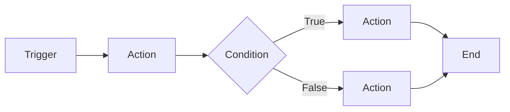

# Automation Flows

Visual workflow automation powered by Temporal - build complex multi-step automations with reliability and scale.

## Overview

Automation Flows are the heart of Interlay's "Automate Anything" promise. Using a visual flow builder powered by React Flow and executed through Temporal workflows, you can create sophisticated automations that integrate with any part of your digital life.

## Architecture

### Visual Flow Builder
- **React Flow Interface**: Drag-and-drop node editor
- **Real-time Preview**: See your flow structure as you build
- **Parameter Configuration**: Dynamic forms for each node type
- **Flow Validation**: Automatic checking for errors and warnings

### Execution Engine
- **Temporal Workflows**: Durable, fault-tolerant execution
- **Event-Driven**: Kafka-powered event streaming
- **Retry Logic**: Automatic retry with exponential backoff
- **Error Recovery**: Comprehensive error handling

## Node Types

### Triggers (Start Events)
Nodes that initiate workflow execution:

#### Time-Based
- **Schedule**: Cron expressions for recurring tasks
- **Delay**: Wait for specific duration
- **Date/Time**: Execute at specific moment

#### Event-Based
- **Email Received**: Gmail integration via PubSub
- **Memory Created**: New Memory Page or Item
- **Webhook**: External HTTP triggers
- **File Upload**: S3 file events
- **Form Submission**: User input triggers

#### Integration Triggers
- **Discord Message**: Bot-monitored channels
- **Calendar Event**: Google Calendar integration
- **API Call**: REST endpoint triggers

### Actions
Nodes that perform operations:

#### Data Operations
- **Create Memory**: Add Memory Pages/Items
- **Update Memory**: Modify existing data
- **Delete Memory**: Remove data (with safeguards)
- **Search Memory**: Query your knowledge base

#### Communication
- **Send Email**: Gmail integration
- **Discord Message**: Post to channels
- **Slack Notification**: Team updates
- **SMS**: Twilio integration

#### AI Operations
- **Generate Text**: GPT-4 content creation
- **Summarize**: Condense long content
- **Extract Data**: Pull structured data from text
- **Classify**: Categorize content automatically
- **Translate**: Multi-language support

#### File Operations
- **Upload File**: S3 storage
- **Download File**: Retrieve from URLs
- **Convert Format**: Transform file types
- **Extract Text**: OCR and parsing

### Conditions
Nodes for flow control:

#### Logic Gates
- **If/Else**: Conditional branching
- **Switch**: Multi-way branching
- **Loop**: Iterate over collections
- **While**: Conditional loops

#### Filters
- **Contains**: Text matching
- **Equals**: Exact comparison
- **Greater/Less Than**: Numerical comparison
- **Regex Match**: Pattern matching

### Human-in-the-Loop
Nodes requiring human interaction:

- **Approval**: Wait for user decision
- **Form Input**: Collect user data
- **Review**: Present data for verification
- **Choose Option**: Multiple choice selection

## Building Flows

### Basic Flow Structure


### Creating Your First Flow

1. **Select a Trigger**
   ```javascript
   {
     type: "trigger.email",
     config: {
       from: "client@example.com",
       subject_contains: "Invoice"
     }
   }
   ```

2. **Add Processing**
   ```javascript
   {
     type: "action.ai.extract",
     config: {
       model: "gpt-4",
       prompt: "Extract invoice details",
       output_format: "json"
     }
   }
   ```

3. **Store Results**
   ```javascript
   {
     type: "action.memory.create",
     config: {
       type: "invoice",
       data: "{{previous.output}}"
     }
   }
   ```

4. **Notify**
   ```javascript
   {
     type: "action.email.send",
     config: {
       to: "accounting@company.com",
       subject: "New invoice processed",
       body: "Invoice {{data.number}} added"
     }
   }
   ```

## Advanced Features

### Variables & Context
Access data throughout your flow:

```javascript
// System variables
{{flow.id}}           // Current flow ID
{{flow.name}}         // Flow name
{{flow.startTime}}    // Execution start
{{user.email}}        // User email

// Node outputs
{{node_1.output}}     // Output from node_1
{{node_2.data.field}} // Specific field

// Memory access
{{memory.search("query")}}
{{memoryItem.get("id")}}
```

### Error Handling

#### Try-Catch Blocks
```javascript
{
  type: "group.try",
  children: [
    // Actions that might fail
  ],
  catch: {
    type: "action.email.send",
    config: {
      to: "admin@company.com",
      subject: "Flow error",
      body: "{{error.message}}"
    }
  }
}
```

#### Retry Configuration
```javascript
{
  type: "action.api.call",
  retry: {
    attempts: 3,
    backoff: "exponential",
    initialDelay: 1000,
    maxDelay: 10000
  }
}
```

### Parallel Execution
Execute multiple branches simultaneously:

```javascript
{
  type: "group.parallel",
  branches: [
    { /* Branch 1 nodes */ },
    { /* Branch 2 nodes */ },
    { /* Branch 3 nodes */ }
  ],
  waitFor: "all" // or "any"
}
```

## Templates

### Email to CRM
Automatically create contacts from emails:
1. Trigger: Email received
2. Extract: Contact information via AI
3. Check: Existing contact
4. Create/Update: Contact record
5. Notify: Sales team

### Document Processing
Process uploaded documents:
1. Trigger: File upload
2. Extract: Text via OCR
3. Analyze: AI summarization
4. Categorize: Auto-tagging
5. Store: In Memory Bank
6. Index: For search

### Meeting Preparation
Automated meeting prep:
1. Trigger: Calendar event (30 min before)
2. Search: Related Memory items
3. Compile: Meeting context
4. Generate: Talking points via AI
5. Send: Email brief

### Social Media Monitor
Track mentions and respond:
1. Trigger: Webhook from monitoring service
2. Analyze: Sentiment via AI
3. Condition: If negative
4. Alert: Customer service
5. Draft: Response via AI
6. Approve: Human review
7. Post: Auto-reply

## Monitoring & Debugging

### Execution Logs
Detailed logging for every execution:
- Node inputs/outputs
- Execution time
- Error messages
- Retry attempts

### Visual Debugging
- Step-through execution
- Breakpoints on nodes
- Variable inspection
- Flow replay

### Performance Metrics
- Average execution time
- Success/failure rates
- Node performance
- Resource usage

## Best Practices

### Design Principles
1. **Keep It Simple**: Start small, iterate
2. **Modular Design**: Reusable sub-flows
3. **Error First**: Plan for failures
4. **Test Thoroughly**: Use test data
5. **Document Well**: Clear node names

### Performance Optimization
- Minimize API calls
- Batch operations when possible
- Cache frequently used data
- Use conditional execution
- Implement circuit breakers

### Security Considerations
- Store credentials in Vault
- Validate all inputs
- Sanitize outputs
- Implement access controls
- Audit sensitive operations

## Integration Patterns

### Webhook Processing
```javascript
// Receive webhook
trigger.webhook →
// Validate signature
action.validate →
// Process payload
action.process →
// Store data
action.memory.create →
// Respond
action.webhook.respond
```

### Batch Processing
```javascript
// Get items
trigger.schedule →
// Query batch
action.memory.query →
// Loop through items
loop.forEach →
  // Process each
  action.process →
  // Update status
  action.memory.update
```

### Event Sourcing
```javascript
// Capture event
trigger.event →
// Store raw event
action.memory.create →
// Process event
action.process →
// Update aggregates
action.memory.update →
// Emit new events
action.event.emit
```

## API Integration

### REST APIs
```typescript
const apiNode = {
  type: "action.api.rest",
  config: {
    method: "POST",
    url: "https://api.example.com/endpoint",
    headers: {
      "Authorization": "Bearer {{vault.api_key}}"
    },
    body: {
      data: "{{previous.output}}"
    }
  }
};
```

### GraphQL
```typescript
const graphqlNode = {
  type: "action.api.graphql",
  config: {
    endpoint: "https://api.example.com/graphql",
    query: `
      mutation CreateItem($input: ItemInput!) {
        createItem(input: $input) {
          id
          name
        }
      }
    `,
    variables: {
      input: "{{data}}"
    }
  }
};
```

## Temporal Integration

### Workflow Definition
```typescript
@Workflow
export class AutomationFlow {
  @WorkflowMethod
  async execute(input: FlowInput): Promise<FlowOutput> {
    // Node execution logic
    for (const node of input.nodes) {
      const result = await this.executeNode(node);
      // Handle result
    }
  }
}
```

### Activity Implementation
```typescript
@Activity
export class NodeActivities {
  async executeAction(node: ActionNode): Promise<any> {
    // Execute specific action
    switch (node.type) {
      case 'email.send':
        return await this.sendEmail(node.config);
      // ... other actions
    }
  }
}
```

---

*Next: [AI Integration →](/core-concepts/ai-integration)*