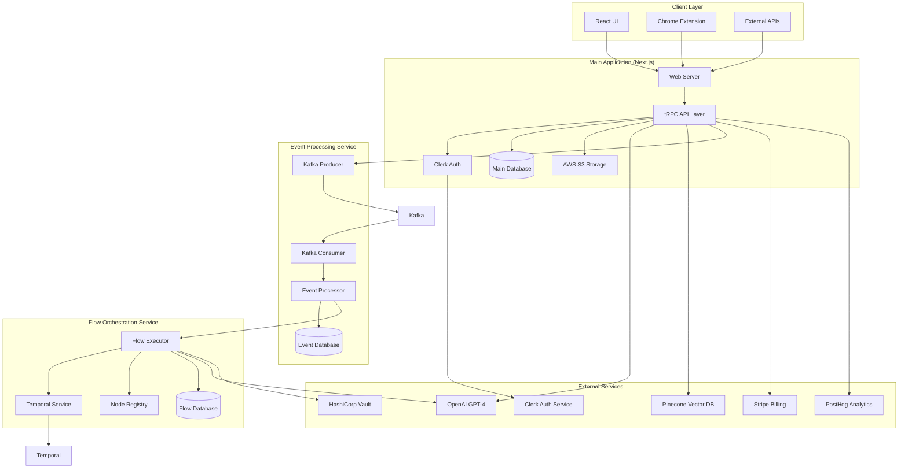

import { Callout } from 'nextra/components'

# System Architecture

Interlay AI employs a sophisticated **distributed microservices architecture** designed for scalability, reliability, and maintainability.

<Callout type="info">
  The system separates concerns across three primary services, each optimized for specific responsibilities while maintaining loose coupling through event-driven communication.
</Callout>

## Architecture Overview



## Core Services

### 1. Main Application Service (Next.js)

**Purpose**: Primary user interface, API gateway, and data management layer

#### Technology Stack
- **Framework**: Next.js 13+ with Pages Router
- **Language**: TypeScript 5.0+
- **UI Framework**: React 18 with Server Components
- **Styling**: Tailwind CSS + Radix UI primitives
- **Database**: PostgreSQL with Prisma ORM
- **Authentication**: Clerk with multi-tenant support
- **API Layer**: tRPC for type-safe client-server communication
- **State Management**: TanStack Query (React Query) + React Context
- **File Storage**: AWS S3 with presigned URLs

#### Key Responsibilities
- User Interface: Responsive web application with mobile-first design
- API Gateway: Centralized API layer for all client requests
- Authentication & Authorization: Multi-tenant user management and security
- Data Management: Primary data storage and retrieval operations
- File Handling: Media upload, processing, and delivery
- Integration Orchestration: Coordinate with external services and microservices

### 2. Event Processing Service

**Purpose**: Handle external triggers, process events, and coordinate between services

#### Technology Stack
- **Runtime**: Node.js 18+ with TypeScript
- **Message Queue**: Apache Kafka for reliable event streaming
- **Database**: PostgreSQL for event storage and processing state
- **Framework**: Express.js for HTTP endpoints and webhook handling
- **Scheduling**: Node-cron for periodic tasks

#### Key Responsibilities
- External Integration Processing: Handle webhooks from Gmail, Discord, etc.
- Event Streaming: Produce and consume Kafka events for inter-service communication
- Trigger Management: Process automation triggers and route to Flow Orchestration
- Data Transformation: Convert external data formats to internal schemas
- Error Handling: Dead letter queues and retry logic for failed events

### 3. Flow Orchestration Service

**Purpose**: Execute automation workflows with reliability and scalability

#### Technology Stack
- **Workflow Engine**: Temporal for durable execution
- **Language**: TypeScript with Node.js 18+
- **Database**: PostgreSQL for flow definitions and execution history
- **Secrets Management**: HashiCorp Vault for OAuth tokens and API keys
- **AI Integration**: OpenAI SDK for AI-powered automation nodes

#### Key Responsibilities
- Workflow Execution: Run multi-step automation flows with fault tolerance
- Node Registry: Manage and execute 25+ automation components
- Human-in-the-Loop: Coordinate approval workflows and user interactions
- Integration Management: Securely handle OAuth tokens and external API calls
- Performance Monitoring: Track execution metrics and optimization opportunities

## Multi-Tenant Database Architecture

### Memory Type-Field-Value Pattern

Flexible data modeling for custom user structures:

```typescript
// Memory Type Definition
interface MemoryType {
  id: string
  tenantId: string  // Tenant isolation
  name: string
  fields: MemoryField[]
}

// Dynamic Field System
interface MemoryField {
  id: string
  memoryTypeId: string
  name: string
  type: 'text' | 'number' | 'date' | 'select' | 'relation'
  config: JsonValue
}

// Actual Data Storage
interface MemoryItem {
  id: string
  memoryTypeId: string
  tenantId: string  // Automatic scoping
  userId: string
  values: MemoryValue[]
}
```

### Tenant Isolation

All data automatically scoped by `tenantId` and `userId`:
- Memory pages with vector embeddings
- Custom memory types and items
- Automation flows and executions
- Integration configurations

## Infrastructure Components

### Vector Database (Pinecone)
- Semantic search across all content
- Automatic embedding generation using OpenAI
- Tenant-isolated namespaces
- Hybrid search capabilities

### Secrets Management (HashiCorp Vault)
- OAuth tokens for integrations
- API keys for external services
- Environment-specific configurations
- Automatic token refresh

### Analytics (PostHog)
- Feature usage tracking
- A/B testing framework
- User behavior analytics
- Performance monitoring

### Payment Processing (Stripe)
- Subscription billing with individual cycles
- Usage-based pricing
- Webhook handling for payment events
- Invoice and receipt management

## Performance & Scalability

### Performance Requirements
- Query Response Times: < 2 seconds for all search operations
- Workflow Execution Reliability: > 99.5% successful completion rate
- AI API Success Rates: > 98% success rate for AI processing
- Real-time Updates: Instant synchronization across services

### Optimization Strategies
- **React Query Caching**: Intelligent server state management
- **Database Indexing**: Strategic indexes for high-traffic patterns
- **Vector Search Optimization**: Efficient Pinecone queries
- **Next.js Optimization**: Image optimization, dynamic imports
- **Background Processing**: Heavy operations in background jobs

### Scaling Architecture
- **Horizontal Scaling**: Multiple instances of each service
- **Database Optimization**: Read replicas for heavy queries
- **CDN Integration**: Global content delivery for media
- **Rate Limiting**: AI API calls with intelligent batching
- **Caching Strategy**: Multi-layer caching (Redis + memory)

## Security Features

### Authentication & Authorization
- **Multi-Tenant Architecture**: Complete data isolation
- **SSO Integration**: Clerk-powered single sign-on
- **Role-Based Access**: Granular permissions system
- **OAuth Management**: Secure storage via Vault
- **Audit Logging**: Complete tracking of all operations

### Production Security
- **Webhook Signature Verification**: All webhooks verify signatures
- **CORS Protection**: Strict origin validation
- **Rate Limiting**: Brute-force protection
- **Security Headers**: CSP, HSTS, X-Frame-Options
- **Soft Delete**: 30-day data retention for recovery

## Next Steps

- Learn about [Development Setup](/getting-started/development-setup)
- Explore [Core Concepts](/core-concepts)
- Review [API Documentation](/api-reference)